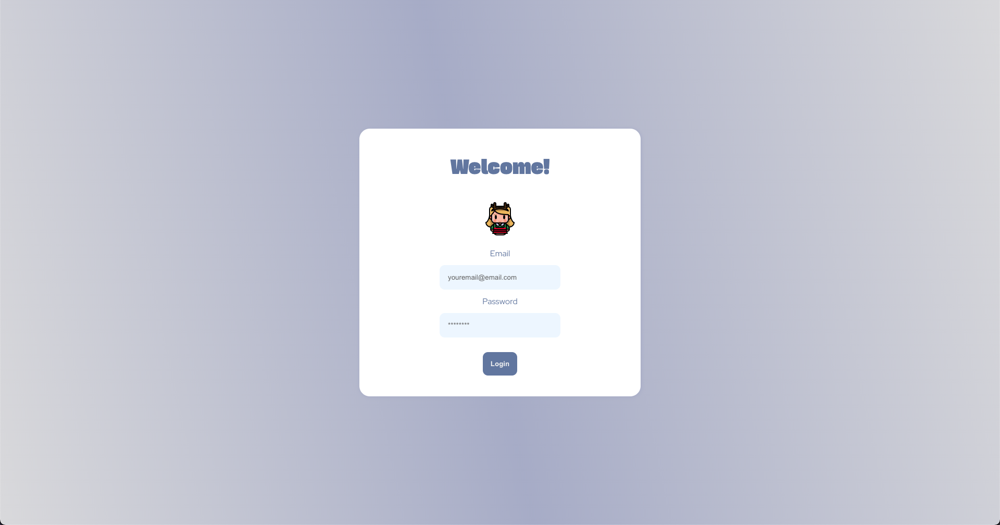

# Login Form App



This react *"login form"* app is a simple authentication application with a login page. Users can enter their email and password, and if the credentials are correct, they are redirected to a successful login screen. If the login attempt is unsuccessful, users are redirected to an unsuccessful login screen where they can try logging in again. The successful login screen displays a welcome message, a kitty icon, and a Spotify embed. Users can log out from the successful login screen to return to the login page. The app uses the `useState` hook for state management and implements conditional rendering to display different screens based on the login status.

## Demo


https://github.com/jnysevilla/login-app/assets/116690031/1d19d6c5-03ce-487c-a1de-217fb2276293


## Table of Contents

- [Features](#features)
- [Getting Started](#getting-started)
  - [Prerequisites](#prerequisites)
  - [Installation](#installation)
- [Usage](#usage)
- [Homework Submission](#homework-submission)


## Features

  - User authentication with a login page.
    - Successful login redirects to a page with a Spotify embed.
    - A button to navigate back to the login page in case of incorrect credentials.

## Getting Started

Follow these instructions to help you set up and run the project on your local machine.

### Prerequisites

>[!IMPORTANT]  
> Ensure that you have `Node.js` and `npm` packages installed.[^1]


### Installation

1. Clone the repository:

   ```bash
   git clone https://github.com/jnysevilla/login-app.git
   ```

2. If you're not already in the project directory, navigate to it using the following command:

    ```bash
    cd login-app
    ```

3. Install dependencies: 

    ```bash
    npm install
    ```

    >[!NOTE]  
    > If you encounter dependency resolution issues during installation, you can try using the `--force` flag with the following command:

      ```bash
      npm install --force
      ```

## Usage

1. Start the development server:

    ```bash
    npm start
    ```
2. To view the app, open your browser and visit http://localhost:3000.
3. Explore the login page. 

## Homework Submission
This homework is submitted by **Jenny Sevilla** for the FullStack Specialization Homework 3.

[^1]: Please follow this [link](https://docs.npmjs.com/downloading-and-installing-node-js-and-npm) on how to install these packages.
